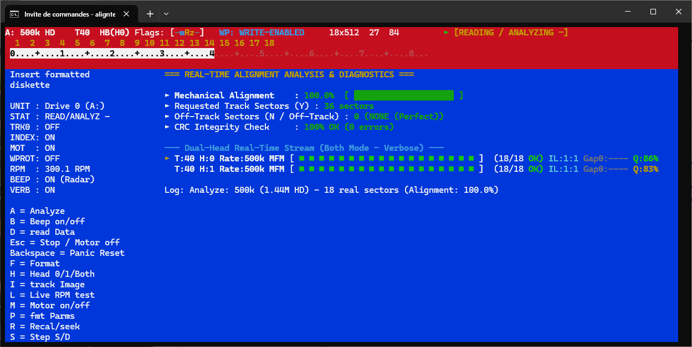

# 💾 AlignTesterDiag 🛠️

[](https://www.rust-lang.org)
[](https://ratatui.rs)
[](https://github.com/keirf/greaseweazle)
[]()
[](LICENSE)

**AlignTesterDiag** is a high-performance, non-blocking, modern terminal user interface (TUI) diagnostics and calibration suite for floppy disk drives. Interfacing directly with a **Greaseweazle USB flux controller**, it bridges Dave Dunfield's classic **ImageDisk (`IMD.C`)** diagnostic methodologies with modern sub-microsecond magnetic flux DPLL decoding and real-time audio-visual feedback.

---

## 🌟 Key Highlights

- ⚡ **100% Non-Blocking Architecture (~60 Hz TUI):** Strict decoupling between the interactive Ratatui/Crossterm rendering loop, the USB hardware acquisition worker thread, and a dedicated real-time audio thread via lock-free `crossbeam-channel` queues.
- 🎯 **Real-Time Mechanical Alignment Radar:** Continuous on-track vs. off-track sector validation with live percentage gauge calculation, detecting misaligned head carriages, tracking errors, and invalid track IDs.
- 🔊 **Dynamic Pitch Acoustic Variometer:** Auditory feedback inspired by glider variometers. Continuously modulates audio frequency from **440 Hz to 1760 Hz** proportional to sector quality ($Q\%$), with instantaneous **220 Hz dissonant warning** on cross-track mismatch and **150 Hz tick** on CRC faults.
- ⏱️ **72 MHz Spindle Tachometer & Live RPM Jitter Gauge:** Sub-microsecond revolution interval timing extracted directly from hardware index pulses. Computes instant RPM, 10-revolution rolling average, peak-to-peak jitter ($\Delta\text{RPM}$, $\pm\Delta\%$), and displays a 21-character visual centering gauge.
- 🔄 **Dual-Head ("Both" Mode) Acquisition:** Alternating Head 0 & Head 1 acquisition with automated cross-track divergence detection ($T_{\text{H0}} \ne T_{\text{H1}}$) and consolidated dual-head health scoring.
- 🔌 **Universal Drive Support (26-Pin FFC & 34-Pin Shugart/PC):** Motor-gated seek with 15 ms electronic wake-up delay (`STEPPER_WAKEUP_DELAY_MS`) to eliminate stepper motor driver lockups on slim laptop mechanisms (e.g. TEAC FD-05HG). Dynamic drive selection (`Drive 0` / `Drive 1`).
- 📊 **Standard & Verbose Live Stream Views:** Color-coded segmented ribbon blocks representing sector-by-sector IDAM/DAM integrity, Gap0 timing in microseconds, and interleave ratio.
- 🛑 **Panic Reset & Safe State Protection:** Instant motor power cut, flux buffer flush, and Greaseweazle bus re-initialization on `Backspace` or `Esc`.

---

## 📸 Interface Preview



*Live track stepping, density autodetection, spindle RPM monitoring, and continuous MFM sector integrity verification in real-time.*

---

## 🚀 Quick Start

### Option A: Pre-compiled Windows Binary (Recommended for Users)

1. Download the latest `aligntester-diag-windows-x64.zip` from the **[Releases](../../releases)** tab.
2. Extract the archive into any local folder.
3. Connect your **Greaseweazle v4 / v4.1** and floppy drive via USB.
4. **Launch via Terminal (Important):** Run the executable inside a terminal window (**Windows Terminal**, **PowerShell**, or **Command Prompt**) rather than double-clicking it from the file explorer. This ensures proper ANSI color rendering, full-size TUI layout, and readable error logs if a COM port issue occurs.

```powershell
# Navigate to your extracted folder and run (auto-detects the Greaseweazle port):
.\aligntester-diag.exe

# Or specify the COM port and Drive unit manually:
.\aligntester-diag.exe COM3 --drive 0
```

### Option B: Build from Source (Developers & Linux / macOS)

### 1. Prerequisites
- **Rust Toolchain:** Stable Rust (2021 edition or newer) & Cargo ([rustup.rs](https://rustup.rs)).
- **Hardware:** Greaseweazle v4 (or compatible v4.1 hardware) connected via USB to a 3.5" or 5.25" floppy drive.
- **Reference Diskette:** A known-good, formatted 3.5" (720K DD / 1.44M HD) or 5.25" (360K DD / 1.2M HD) floppy diskette.

### 2. Build from Source
```bash
git clone https://github.com/your-username/AlignTesterDiag.git
cd AlignTesterDiag
cargo build --release
```

### 3. Execution
Auto-detect connected Greaseweazle device on Drive 0:
```bash
cargo run --release
```

Specify COM port and Drive Unit explicitly:
```bash
# Windows
cargo run --release -- COM3 --drive 0

# Linux / macOS
cargo run --release -- /dev/ttyACM0 --drive 1
```

---

## ⌨️ Interactive Keybindings Quick Reference

| Key | Action | Description |
|:---:|:---|:---|
| <kbd>A</kbd> | **Analyze** | Start continuous real-time track alignment analysis |
| <kbd>D</kbd> | **Read Data** | Read and test sector CRC integrity across the cylinder |
| <kbd>L</kbd> | **Live RPM** | Launch 72 MHz high-precision spindle tachometer mode |
| <kbd>B</kbd> | **Beep (Audio Radar)** | Toggle acoustic pitch variometer on / off |
| <kbd>H</kbd> | **Toggle Head** | Cycle head selection: `Head 0` ➔ `Head 1` ➔ `BOTH (0+1)` |
| <kbd>U</kbd> | **Toggle Drive Unit** | Switch active drive: `Drive 0 (A:)` ➔ `Drive 1 (B:)` |
| <kbd>M</kbd> | **Toggle Motor** | Manually assert / negate spindle motor power line |
| <kbd>V</kbd> | **Toggle Verbose** | Switch between Standard and Detailed Verbose Stream views |
| <kbd>R</kbd> | **Recalibrate** | Recalibrate carriage to Track 0 and return to current track |
| <kbd>Z</kbd> | **Zero Track** | Direct single seek step return to Track 0 |
| <kbd>+</kbd> / <kbd>→</kbd> | **Step Forward (+1)** | Step carriage forward by +1 track (up to Track 83) |
| <kbd>-</kbd> / <kbd>←</kbd> | **Step Backward (-1)** | Step carriage backward by -1 track (down to Track 0) |
| <kbd>0</kbd>–<kbd>9</kbd> | **Direct Seek** | Direct seek jump to decade tracks (0, 10, 20 ... 80) |
| <kbd>Esc</kbd> | **Stop** | Stop spindle motor, flush pending buffers, enter safe state |
| <kbd>Backspace</kbd> | **Panic Reset** | Emergency instant motor cut and hardware re-initialization |
| <kbd>X</kbd> / <kbd>Ctrl+C</kbd> | **Exit** | Clean shutdown (cuts spindle motor, disables LEDs, exits raw mode) |

---

## 💻 CLI Options & Syntax

```text
aligntester-diag [PORT] [OPTIONS]

ARGUMENTS:
  [PORT]               Serial port name (e.g. COM3, /dev/ttyACM0). Auto-detected if omitted.

OPTIONS:
  -d, --drive <0|1>    Select target floppy drive unit (0 = Drive A:, 1 = Drive B:). Default: 0
      --drive=<0|1>    Alternative key-value syntax for drive unit selection
  -h, --help           Print help information
```

---

## 📖 Comprehensive Technical Documentation

For an exhaustive technical breakdown of the DPLL flux recovery engine, Greaseweazle low-level protocol opcodes, electromechanical timing constants, acoustic modulation equations, and multi-system retro formats, please refer to:

👉 **[Complete Technical Documentation (`documentation.md`)](documentation.md)**

---

## 📁 Repository Structure

```text
AlignTesterDiag/
├── Cargo.toml                 # Manifest & dependencies (ratatui, crossterm, serialport, crossbeam-channel)
├── src/
│   ├── main.rs                # Application entrypoint, CLI argument parser, main event loop
│   ├── app.rs                 # State management, Action dispatcher, Dual-head metrics consolidation
│   ├── audio.rs               # Real-time sound worker thread, dynamic pitch calculation, platform beeps
│   ├── ui.rs                  # TUI components, styled ribbon spans, centering gauges, track ruler
│   ├── hw/
│   │   └── mod.rs             # Greaseweazle USB communication, DPLL, MFM decoding, hardware timings
│   └── bin/
│       ├── gw_read_track.rs   # Standalone flux cell duration measurement tool
│       ├── gw_test.rs         # Standalone Greaseweazle command verification utility
│       ├── test_mfm_decoder.rs# Standalone MFM bitstream & IDAM decoder test harness
│       └── test_sector_gen.rs # Interleave & sector geometry verification tool
└── export/
    ├── README.md              # Distribution showcase & quick reference
    ├── documentation.md       # Complete unified technical specification & manual
    └── Medias/                # Asset & screenshot directory
```

---

## 📄 License & Credits

- Copyright (C) 2026 Mr JeAn-FReD 🇫🇷
- **Heritage:** Inspired by Dave Dunfield's **ImageDisk (`IMD`)** and Keir Fraser's **Greaseweazle**.
- **License:** Distributed under the terms of the [GNU General Public License v3.0 (GPL-3.0)](LICENSE).
