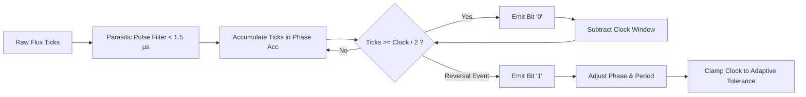

# 💾 AlignTesterDiag v1.0.0 — Comprehensive Technical Documentation & Architecture Manual

Welcome to the definitive technical documentation for **AlignTesterDiag**, an ultra-responsive, non-blocking terminal user interface (TUI) diagnostics, formatting, and calibration platform for floppy disk drives connected via the **Greaseweazle USB flux controller**.

---

## 📑 Table of Contents

1. [System Architecture & Concurrency Model](#1-system-architecture--concurrency-model)
2. [Greaseweazle Hardware Protocol & Interfacing](#2-greaseweazle-hardware-protocol--interfacing)
3. [Electromechanical Timings & Drive Compatibility](#3-electromechanical-timings--drive-compatibility)
4. [Magnetic Flux Processing & DPLL MFM Decoder](#4-magnetic-flux-processing--dpll-mfm-decoder)
5. [Real-Time Alignment Diagnostic Engine](#5-real-time-alignment-diagnostic-engine)
6. [Acoustic Variometer & Alignment Radar](#6-acoustic-variometer--alignment-radar)
7. [High-Precision Spindle Tachometer & Live RPM Jitter Engine](#7-high-precision-spindle-tachometer--live-rpm-jitter-engine)
8. [High-Precision Low-Level Format Engine & MFM Synthesizer](#8-high-precision-low-level-format-engine--mfm-synthesizer)
9. [User Interface, Visual Indicators & Controls](#9-user-interface-visual-indicators--controls)
10. [Automated Test & Verification Suite](#10-automated-test--verification-suite)
11. [Technical Roadmap & Multi-System Future Support](#11-technical-roadmap--multi-system-future-support)

---

## 1. System Architecture & Concurrency Model

AlignTesterDiag is engineered around a **100% non-blocking, multi-threaded architecture** designed to maintain a consistent ~60 Hz terminal rendering framerate while continuously capturing raw flux transitions over USB, decoding multi-system retro disk layouts, and synthesizing pitch-modulated audio feedback.

### 1.1 Concurrency Topology
The application executes across three decoupled OS threads:

1. **Main UI & Render Thread (`src/main.rs`, `src/ui.rs`):**
   - Drives the **Ratatui** and **Crossterm** TUI engine.
   - Drains incoming status updates from the hardware worker via `rx_status.try_recv()`.
   - Polls keyboard input with a 15 ms timeout slice (`crossterm::event::poll(Duration::from_millis(15))`).
   - Translates key presses into strongly-typed `HwCmd` messages sent to `tx_cmd`.
2. **Hardware I/O & Decoding Thread (`src/hw/mod.rs`):**
   - Owns the USB CDC serial connection to the Greaseweazle hardware (`serialport`).
   - Manages drive selection, motor power sequencing, track seeking, low-level formatting, hardware erasing, and raw flux stream captures.
   - Executes the software Digital Phase-Locked Loop (DPLL) and MFM sector decoding pipeline (IBM PC, Amiga, Atari ST, Amstrad CPC).
   - Publishes periodic `DriveStatus` snapshots via `tx_status`.
   - Dispatches `AudioEvent` notifications to the audio thread via `tx_audio`.
3. **Real-Time Sound Worker Thread (`src/audio.rs`):**
   - Listens on a dedicated unbounded channel for `AudioEvent` signals.
   - Automatically drains intermediate backlog events to eliminate latency and acoustic lag.
   - Issues non-blocking Win32 `Beep()` or POSIX terminal bell pulses.

### 1.2 Thread Communication Enums & Structures

```rust
pub enum HwCmd {
    SelectUnit(u8),
    ToggleDriveUnit,
    SetMotor(bool),
    ToggleMotor,
    MeasureRpm,
    CycleRpmMode,
    Seek(u8),
    RecalibrateSeek,
    ZeroTrack,
    SetHead(u8),
    SetHeadSelection(HeadSelection),
    ToggleHead,
    Analyze,
    StartAnalysis,
    ReadData,
    ToggleVerbose,
    ToggleBeep,
    SetVerbose(bool),
    SetBeep(bool),
    FormatTrack { track: u8, head_sel: HeadSelection, verify: bool, fs_mode: FsInitMode, preset: PresetProfile },
    FormatDisk { range: TrackRange, head_sel: HeadSelection, verify: bool, fs_mode: FsInitMode, preset: PresetProfile },
    EraseTrack { track: u8, head_sel: HeadSelection },
    EraseDisk { range: TrackRange, head_sel: HeadSelection },
    Stop,
    PanicReset,
    SetDiskFormat(DiskFormat),
    CycleDiskFormat,
    SetBusType(BusType),
    ToggleBusType,
    SetStepMode(StepMode),
    ToggleStepMode,
    CyclePreset,
    SetPreset(PresetProfile),
    Exit,
}

/// Filesystem payload initialization mode for formatting
pub enum FsInitMode {
    /// Raw unformatted sectors filled with standard byte 0xE5
    Blank,
    /// OS-ready initialization with valid boot sector, FAT/OFS/CPM structures, and root directory
    OsReady,
}

/// Floppy head selection mode for analysis, formatting and erasing
pub enum HeadSelection {
    Head0,
    Head1,
    Both,
}

/// Explicit confirmation state for destructive actions (Format / Erase)
pub enum PendingConfirmation {
    FormatTrack { track: u8, head_sel: HeadSelection, verify: bool, fs_mode: FsInitMode, preset: PresetProfile },
    FormatDisk { range: TrackRange, head_sel: HeadSelection, verify: bool, fs_mode: FsInitMode, preset: PresetProfile },
    FormatRange { range: TrackRange, head_sel: HeadSelection, verify: bool, fs_mode: FsInitMode, preset: PresetProfile },
    EraseTrack { track: u8, head_sel: HeadSelection },
    EraseDisk { range: TrackRange, head_sel: HeadSelection },
    EraseRange { range: TrackRange, head_sel: HeadSelection },
}

/// Modal editor context and field selection
pub enum RangeModalKind {
    Format,
    Erase,
}

pub enum RangeField {
    Start,
    End,
}

/// Bounded contiguous track range specification
pub struct TrackRange {
    pub start: u8,
    pub end: u8,
}
```

---

## 2. Greaseweazle Hardware Protocol & Interfacing

AlignTesterDiag interfaces directly with the Greaseweazle firmware over USB CDC Virtual COM port at 115,200 baud. It supports automated device discovery and communicates using the native Greaseweazle binary protocol.

### 2.1 Auto-Discovery
During startup, `find_greaseweazle()` scans all available serial ports for USB Vendor/Product IDs:
- **VID:** `0x1209` (Generic Open Source Hardware)
- **PID:** `0x4D22` (Greaseweazle v4) / `0x4D69` (Greaseweazle v4.1)

If USB enumeration fails, the engine falls back to testing standard serial paths (`COM2`, `COM10`, `/dev/ttyACM0`, `/dev/ttyS2`) by asserting DTR/RTS control lines.

### 2.2 Protocol Opcode Reference

All commands follow the Greaseweazle frame format: `[CMD_OPCODE, FRAME_LENGTH, ARGS...]`. The controller responds with a 2-byte header `[CMD_ECHO, STATUS]` followed by optional payload bytes.

| Opcode (Hex) | Command Name | Arguments | Response Payload | Purpose |
|:---|:---|:---|:---|:---|
| `0x00` | `CMD_GET_INFO` | `[0x00, 0x03, 0x00]` | 32 bytes | Query firmware version, hardware model, sample clock frequency |
| `0x0E` | `CMD_SET_BUS_TYPE` | `[0x0E, 0x03, bus_type]` | 0 bytes | Configure interface pinout (`0x01` = IBM PC standard, `0x02` = Shugart standard) |
| `0x0C` | `CMD_SELECT` | `[0x0C, 0x03, unit]` | 0 bytes | Assert drive select line (`0` = Drive A / DS0, `1` = Drive B / DS1, `2` = DS2, `3` = DS3) |
| `0x0D` | `CMD_DESELECT` | `[0x0D, 0x02]` | 0 bytes | Deselect all drive units / release interface bus |
| `0x06` | `CMD_MOTOR` | `[0x06, 0x04, unit, state]` | 0 bytes | Control spindle motor (`1` = ON, `0` = OFF) |
| `0x02` | `CMD_SEEK` | `[0x02, 0x03, cyl]` | 0 bytes | Step head carriage to logical cylinder (`0` to `83`) |
| `0x03` | `CMD_HEAD` | `[0x03, 0x03, head]` | 0 bytes | Select physical head (`0` = Lower / Side 0, `1` = Upper / Side 1) |
| `0x07` | `CMD_READ_FLUX` | `[0x07, 0x08, 0x00, 0x00, 0x00, 0x00, rev_low, rev_high]` | Stream | Stream raw magnetic flux transition timings (64 KB extended reception buffer) |
| `0x08` | `CMD_WRITE_FLUX` | `[0x08, 0x04, cue_at_index, terminate_at_index]` | Status ACK | Write raw flux stream (`cue_at_index = 0` for AmigaDOS, `cue_at_index = 1` for PC/Atari/CPC) |
| `0x11` | `CMD_ERASE_FLUX` | `[0x11, 0x06, ticks_le_u32]` | Status ACK | Assert continuous neutral write gate without flux transitions for specified sample ticks ($\ge 1.1$ revs) |
| `0x14` | `CMD_GET_PIN` | `[0x14, 0x03, pin_num]` | 1 byte | Read logic level of physical connector pin |

<details>
<summary>🔍 <b>Hardware Pin Monitoring Details (Active-Low Signals)</b></summary>

Floppy interface signals utilize active-low open-collector logic ($0 = \text{Asserted / Low}$, $1 = \text{Negated / High}$). AlignTesterDiag monitors:

- **Pin 28 (`/WRTPRT`):** Write Protect sensor. Sampled via `CMD_GET_PIN (0x14, 28)`. Low indicates the diskette write-protect notch is open.
- **Pin 26 (`/TRK00`):** Optical Track 0 sensor. Read via `DriveStatus`. Indicates carriage is resting at the physical base stop.
- **Pin 8 (`/INDEX`):** Spindle index pulse sensor. Emits one low pulse per revolution.
</details>

---

## 3. Electromechanical Timings & Drive Compatibility

Floppy disk drives incorporate physical stepper motors, lead screws, and rotating mechanical spindles subject to inertia and vibration. AlignTesterDiag enforces strict timing constants to ensure reliable operation across legacy 34-pin PC drives and 26-pin slim notebook drives.

```text
[Motor Start] ──(350 ms)──> [Spindle Stabilized @ 300 RPM]
[Step Pulse]  ──(15-30 ms)─> [Vibration Dampened] ──> [Flux Read]
[Head Switch] ──(1 ms)────> [Preamplifier Settled] ──> [Flux Read]
```

### 3.1 Electromechanical Timing Constants

| Constant | Value | Description & Technical Rationale |
|:---|:---:|:---|
| `STEPPER_WAKEUP_DELAY_MS` | `15 ms` | **Stepper Driver Electronic Wake-up Delay:** On 26-pin FFC drives (e.g. TEAC FD-05HG with adapter), the stepper motor driver IC is powered down when the spindle motor signal is negated. This delay ensures power rail stabilization before issuing step pulses. |
| `HEAD_SETTLE_TIME_MS` | `30 ms` | **Head Settling & Damping Delay:** Mechanical carriage dampening time after a multi-track seek to eliminate head bounce and vibration before reading flux. |
| `FORMAT_HEAD_SETTLE_MS` | `100 ms` | **Format Track Step Settle Delay:** Robust mechanical carriage dampening time after single-track stepping during low-level format operations. |
| `FORMAT_HEAD_SWITCH_SETTLE_MS` | `50 ms` | **Format Head Switch Settle Delay:** Preamplifier stabilization delay when switching between Head 0 and Head 1 during format operations on the same cylinder. |
| `HEAD_SWITCH_SETTLE_MS` | `1 ms` | **Electronic Head Switch Settle Time:** Preamplifier stabilization delay when switching between Head 0 and Head 1. |
| `SPIN_UP_DELAY_MS` | `350 ms` | **Motor Spin-Up Delay:** Time required for the DC brushless spindle motor to accelerate from 0 to 300 RPM and lock index synchronization. |
| `RECALIBRATE_WAIT_MS` | `200 ms` | **Track 0 Shock Dissipation Delay:** One full disk revolution (~200 ms) allowed after optical stop recalibration to dissipate mechanical shock before MFM decoding. |
| `DWELL_TIME_TRK0_MS` | `60 ms` | **Dwell Time at Track 0:** Carriage stabilization pause at the physical stop during recalibrate-and-return sequences. |
| `SEEK_TRK0_TIMEOUT_MS` | `3000 ms` | **Track 0 Seek Timeout:** Maximum guard window during optical base stop homing operations. |
| `DEFAULT_SERIAL_TIMEOUT_MS` | `1000 ms` | **USB Flux Read Timeout:** Maximum allowable communication window for flux packet reception. |
| `ACK_GUARD_TIMEOUT_MS` | `500 ms` | **Hardware ACK Guard Timeout:** Response timeout on low-level command acknowledgments. |
| `SYNC_DELAY_MS` | `30 ms` | **Bus Protocol Synchronization Pause:** Short stabilization delay during bus mode re-sync. |

### 3.2 Motor-Gated Seek Operation
When stepping tracks while the motor is stopped, issuing immediate step pulses will fail on 26-pin drives whose stepper drivers are powered off. `perform_motor_gated_seek()` resolves this:
1. Temporarily asserts motor power (`CMD_MOTOR = 1`).
2. Waits `STEPPER_WAKEUP_DELAY_MS` (15 ms) for driver IC stabilization.
3. Issues `CMD_SEEK` to the target cylinder.
4. Restores motor state to OFF.

If the motor is already running (e.g., in Analyze or Tachometer mode), the seek executes immediately without extra latency.

---

## 4. Magnetic Flux Processing & DPLL MFM Decoder

AlignTesterDiag implements a high-performance software **Digital Phase-Locked Loop (DPLL)** and **Modified Frequency Modulation (MFM)** decoding engine capable of recovering clean bitstreams from noisy analog flux reversals.

### 4.1 Greaseweazle Flux Encoding
Greaseweazle transmits flux transitions as a stream of byte-encoded timer ticks measured against its internal **72 MHz sample clock**:
- Byte `1..=249`: A flux reversal occurred $N$ ticks after the previous event.
- Byte `0xFA`: Extension marker adding $+250$ ticks without a flux reversal.

$$\text{Interval (seconds)} = \frac{\text{Total Ticks}}{72{,}000{,}000}$$

### 4.2 Software DPLL Architecture
The software DPLL (`SoftwarePll`, `pll_flux_to_mfm_bits`) dynamically tracks spindle speed fluctuations and instantaneous phase jitter:



$$\text{Clock}_{\text{nom}} = \frac{72{,}000{,}000}{2 \times \text{Bitrate (bps)}} \implies \begin{cases} 72.0 \text{ ticks} & \text{for 500 kbps (HD)} \\ 120.0 \text{ ticks} & \text{for 300 kbps (DD @ 360 RPM, Pc525DdOnHd)} \\ 144.0 \text{ ticks} & \text{for 250 kbps (DD @ 300 RPM)} \end{cases}$$

#### Adaptive Clamping Tolerance & Noise Filtering:
- **High Density (500 kbps / 72.0 ticks):** Nominal $\pm 10\%$ tolerance ($\text{Clock}_{\min} = 64.8$, $\text{Clock}_{\max} = 79.2$, $\text{Phase Adj} = 0.60$) for dense, low-jitter flux cells.
- **Double Density (250 kbps & 300 kbps / $\ge 100.0$ ticks):** Extended $\pm 25\%$ tolerance ($\text{Clock}_{\min} = \text{Clock}_{\text{nom}} \times 0.75$, $\text{Clock}_{\max} = \text{Clock}_{\text{nom}} \times 1.25$, $\text{Phase Adj} = 0.65$) to absorb heavy spindle flutter and phase jitter on legacy 5.25" and 3.5" media.
- **Parasitic Noise Filtering (< 1.5 µs / 108 ticks @ 72 MHz):** In DD modes ($\text{Clock}_{\text{nom}} \ge 100.0$ ticks), pulses under 108 ticks generated by 48 TPI fringe track noise are accumulated and merged into subsequent flux transitions.

Phase adjustment ($\alpha$) and period adjustment ($\beta = 0.05$) adapt the clock window on every valid flux pulse:
$$\text{Clock} \leftarrow \text{Clock} + \Delta\text{Ticks} \times \beta$$

### 4.3 Automated Density & Format Recognition
By evaluating average flux transition intervals and sync patterns across the initial revolution, the engine classifies media density and formatting automatically:
- **Average Cell $\le 240$ ticks:** High Density (HD, 500 kbps, 18 sectors/track @ 300 RPM).
- **Average Cell $> 240$ ticks:** Double Density (DD, 250 kbps, 9 sectors/track IBM/Atari, 11 sectors/track Amiga @ 300 RPM, or 300 kbps 360K @ 360 RPM).

---

## 5. Real-Time Alignment Diagnostic Engine

AlignTesterDiag performs continuous on-track vs. off-track sector validation to diagnose head alignment, radial track drift, and azimuth tilt.

### 5.1 Alignment Score Calculation
Alignment quality is expressed as the percentage of valid sectors found on the target cylinder ($C_{\text{target}}$) without CRC errors:

$$\text{Score} = \left( \frac{\text{On-Track Valid Sectors}}{\text{Total Expected Sectors}} \right) \times 100\%$$

- **100.0% (Green):** Nominal radial alignment. All expected sectors match the physical cylinder.
- **70.0% – 99.9% (Yellow):** Marginal tracking or minor head azimuth deviation.
- **< 70.0% (Red):** Severe head misalignment, off-track seeking error, or magnetic media degradation.

### 5.2 Multi-System Sector Decoding & Ribbon Rendering
- **IBM PC / Atari ST (ISO MFM):** Synchronizes on altered sync words `0xA1*` (`0x4489`). Evaluates IDAM headers (`Cyl, Head, Sector, Size`) and DAM payloads with CCITT CRC-16.
- **Commodore Amiga (Paula MFM):** Decodes raw 32-bit sync words `0x44894489`, deinterleaves split *even/odd* longwords, and validates 32-bit XOR header/data checksums. Renders a strict 11-block DD ribbon: `[ ■ ■ ■ ■ ■ ■ ■ ■ ■ ■ ■ ] (11/11 OK)`. In case of multi-revolution acquisition, automatically performs cross-revolution sector de-duplication and CRC repair.
- **Amstrad CPC (µPD765):** Detects DATA format (`0xC1`–`0xC9`) and SYSTEM format (`0x41`–`0x49`) sector IDs.

---

## 6. Acoustic Variometer & Alignment Radar

Inspired by aeronautical glider variometers, AlignTesterDiag incorporates a real-time **Dynamic Pitch Acoustic Variometer** providing instantaneous auditory feedback on head carriage alignment.

### 6.1 Frequency Tier Mapping

$$\text{Frequency} = \begin{cases}
1500\text{ Hz} + \left(\frac{\text{Score} - 95}{5}\right) \times 700\text{ Hz} & \text{if Score} \ge 95\% \quad (1500\text{--}2200\text{ Hz, High Clear Tone}) \\
600\text{ Hz} + \left(\frac{\text{Score} - 70}{25}\right) \times 800\text{ Hz} & \text{if } 70\% \le \text{Score} < 95\% \quad (600\text{--}1400\text{ Hz, Medium Tone}) \\
250\text{ Hz} + \left(\frac{\text{Score}}{70}\right) \times 250\text{ Hz} & \text{if } 0 < \text{Score} < 70\% \quad (250\text{--}500\text{ Hz, Low Continuous Drone}) \\
150\text{ Hz} \text{ (40 ms warning hum)} & \text{if Score} = 0\% \text{ (No Decoded Sectors)}
\end{cases}$$

### 6.2 Track Divergence & Mismatch Alert
When reading a cylinder where decoded sectors belong to a different physical track ($C_{\text{decoded}} \ne C_{\text{target}}$), the variometer immediately emits a **180 Hz pulsed warning buzz (2x 50 ms)** to alert the technician of stepper slippage or severe track offset.

---

## 7. High-Precision Spindle Tachometer & Live RPM Jitter Engine

Accessed via the <kbd>L</kbd> key, the Spindle Tachometer measures rotational velocity using 72 MHz timer captures with sub-microsecond precision.

### 7.1 Multi-Mode Measurement & Contextual 'I' Key
The tachometer supports three distinct measurement topologies toggled via the <kbd>I</kbd> key (`CycleRpmMode`):
1. **Hardware Pin 8 Index Mode (`HW Index`):** Measures the time interval between consecutive hardware index pulses on Pin 8 via inter-index flux summation.
2. **Targeted PLL Software Sync Mode (`SW Sync`):** Reconstructs instantaneous rotational speed from decoded MFM sync pulse intervals (`0x4489`) when the physical index sensor is disconnected or for soft-sectored drives.
3. **Dual Mode & Differential ($\Delta\text{RPM}$):** Concurrently captures both HW Index and SW Sync, displaying both values along with the real-time differential drift:
   $$\Delta\text{RPM} = |\text{RPM}_{\text{HW}} - \text{RPM}_{\text{SW}}|$$

### 7.2 Spindle Speed Mathematics & Centering Gauge
$$\text{RPM}_{\text{inst}} = \frac{60 \times 72{,}000{,}000}{\text{Total Revolution Ticks}}$$

A 10-revolution rolling window computes the smoothed average $\overline{\text{RPM}}$ and peak-to-peak jitter ($\Delta\text{RPM}_{\text{P-P}}$):

$$\Delta\text{RPM} = \text{RPM}_{\max} - \text{RPM}_{\min}, \quad \text{Jitter \%} = \pm \left( \frac{\Delta\text{RPM}}{2 \times \overline{\text{RPM}}} \right) \times 100\%$$

The UI renders a **21-character dynamic centering gauge**:
```text
RPM: 300.0 RPM  Jitter: ±0.03%  [---------|---------]  (Nominal: 300.0 RPM)
```

| Jitter Range | Visual Rating | Diagnosis |
|:---:|:---:|:---|
| $\le \pm 0.10\%$ | `★★★★★` | **EXCELLENT:** Direct-drive quartz-locked spindle; zero mechanical slip. |
| $\le \pm 0.25\%$ | `★★★★☆` | **GOOD:** Normal belt-driven drive in healthy operational condition. |
| $\le \pm 0.50\%$ | `★★★☆☆` | **ACCEPTABLE:** Minor belt stretch or slight bearing friction. |
| $\le \pm 1.00\%$ | `★★☆☆☆` | **MARGINAL:** Worn drive belt or dirty spindle pulley needing service. |
| $> \pm 1.00\%$ | `★☆☆☆☆` | **UNSTABLE MOTOR SPEED:** Defective drive belt, failing motor controller, or excessive friction. |

---

## 8. High-Precision Low-Level Format Engine & MFM Synthesizer

Accessed via the <kbd>F</kbd> key, the Low-Level Format Engine enables bit-accurate track and whole-disk magnetic formatting directly through Greaseweazle's `CMD_WRITE_FLUX` (0x08) protocol command.

### 8.1 Zero-Allocation MFM Synthesizer Architecture (`src/hw/format.rs`)

1. **Static Conversion Tables:**
   - **MFM Clock/Data Encoding:** Static $2 \times 256$ entry lookup table (`MFM_ENCODE_TABLE`) encoding data bit $1 \to 01$, bit $0$ (after $0$) $\to 10$, bit $0$ (after $1$) $\to 00$.
   - **Altered Sync Drops:** Generates missing clock sync words `0xA1*` (clock transition drop $0x0A$ instead of $0x0E$, producing MFM word `0x4489`) for IDAM (`0xFE`) and DAM (`0xFB`).
   - **CRC16-CCITT Accelerator:** Precomputed 256-word lookup table (`const CRC16_TABLE`) using polynomial `0x1021` and initial seed `0xFFFF`.

2. **Supported Format Preset Layouts:**
   - **IBM PC 1.44M HD:** 18 sectors/track (512B, Gap1=80, Gap2=22, Gap3=84, fill=0xE5, 500 kbps @ 300 RPM).
   - **IBM PC 720K DD:** 9 sectors/track (512B, Gap1=32, Gap2=22, Gap3=54, fill=0xE5, 250 kbps @ 300 RPM).
   - **IBM PC 1.2M 5.25" HD:** 15 sectors/track (512B, Gap1=80, Gap2=22, Gap3=84, fill=0xE5, 500 kbps @ 360 RPM).
   - **IBM PC 360K (HD Drive):** 9 sectors/track (512B, Gap1=32, Gap2=22, Gap3=54, fill=0xE5, 300 kbps @ 360 RPM, Step 2:1).
   - **IBM PC 360K (DD Drive):** 9 sectors/track (512B, Gap1=32, Gap2=22, Gap3=54, fill=0xE5, 250 kbps @ 300 RPM, Step 1:1).
   - **AmigaDOS DD (880K):** 11 sectors/track (512B, split even/odd Paula, 0x4489 sync, 32-bit XOR checksum, 250 kbps).
   - **Atari ST & Amstrad CPC Data:** 9 sectors/track (512B, 250 kbps).

### 8.2 Paula Asynchronous Continuous Stream Writing (`src/hw/format.rs`, `src/hw/mod.rs`)

The Commodore Amiga Paula disk controller uses a unique architecture compared to Western Digital (WD177x) or NEC (µPD765) floppy controllers:
- **Asynchronous Un-Indexed Writing (`cue_at_index = false`):** Paula does not synchronize track writes to the physical index hole. AlignTesterDiag sets `cue_at_index = false` in `CMD_WRITE_FLUX`, initiating flux emission immediately upon command.
- **Clean Track Layout (No Artificial Lead-In):** The track begins immediately with the first sector's sync words (`0x44894489`), eliminating artificial leading zero gaps that could misalign sector spacing.
- **Split Even/Odd MFM Architecture:**
  1. Sync: 2 raw words `0x44894489` (32 MFM bits).
  2. Info: 32-bit word `[0xFF, track_num, sec_id, 11 - sec_id]` split into 32 even bits + 32 odd bits.
  3. Label: 16 bytes (4 longwords) split into even and odd arrays.
  4. Header Checksum: 32-bit XOR checksum over Info and Label longwords masked to `0x55555555`.
  5. Data Field: 512 bytes (128 longwords) split into 128 even longwords followed by 128 odd longwords.
  6. Data Checksum: 32-bit XOR checksum over all 128 data longwords.
  7. Inter-Sector Gap: 1 byte of 0x00 MFM (16 bits / 2 bytes MFM `0xAAAA`).
- **Over-Write Splice Loop (~108,000 MFM Bits):** The synthesizer continuously repeats consecutive sectors (0..10) until reaching at least 108,000 MFM bits ($\approx 1.08$ to $1.13$ revolutions / $\approx 216\text{ ms}$). This guarantees that previous magnetic flux is completely overwritten and creates a seamless splice loop across physical spindle speed variations (295–305 RPM).
- **Physical Hardware Validation:** Verified 100% on real Commodore Amiga 500 hardware under Amiga Test Kit (`........... (11/11 okay)`).

### 8.3 72 MHz Flux Translation & Write Pre-Compensation

1. **Cycle-Accurate Timings:**
   - $500\text{ kbps} \implies 1T = 72\text{ ticks}, 2T = 144\text{ ticks}, 3T = 216\text{ ticks}, 4T = 288\text{ ticks}$.
   - $300\text{ kbps} \implies 1T = 120\text{ ticks}, 2T = 240\text{ ticks}, 3T = 360\text{ ticks}, 4T = 480\text{ ticks}$.
   - $250\text{ kbps} \implies 1T = 144\text{ ticks}, 2T = 288\text{ ticks}, 3T = 432\text{ ticks}, 4T = 576\text{ ticks}$.

2. **Write Pre-Compensation on Inner Cylinders ($> 40$):**
   - Applies $\pm 125\text{ ns}$ ($\approx 9\text{ ticks}$ @ 72 MHz) shifts to counteract magnetic peak shift:
     * $2T$ followed by $\ge 3T \implies$ shifted **EARLY** ($-9\text{ ticks}$ on $2T$, $+9\text{ ticks}$ on $\ge 3T$).
     * $\ge 3T$ followed by $2T \implies$ shifted **LATE** ($+9\text{ ticks}$ on $\ge 3T$, $-9\text{ ticks}$ on $2T$).
     * Symmetrical intervals ($2T-2T$ or $\ge 3T - \ge 3T$) have zero pre-compensation shift.

### 8.4 Filesystem Payload Synthesizer & OS-Ready Mode (`src/hw/fs.rs`)

When formatting in **OS-Ready mode** (toggled with <kbd>S</kbd> in `FormatModal`), the synthesizer injects valid logical filesystem structures into the raw MFM track payload:

```text
Low-Level Format (CMD_WRITE_FLUX)
 ├── [S] FsInitMode::Blank   ──► Raw 0xE5 unformatted byte pattern across all sectors
 └── [S] FsInitMode::OsReady ──► Logical OS Boot & Root Filesystem Injection:
       ├── DOS FAT12 (PC)    ──► Sector 0 BPB (MSDOS5.0), FAT1/FAT2 with Media Desc, Root Dir, 0x55AA
       ├── Atari ST TOS      ──► TOS BPB, 16-bit Boot Checksum (sum == 0x1234), FAT1/FAT2
       ├── AmigaDOS OFS      ──► Bootblock (DOS\0, 32-bit checksum), RootBlock (880), BitmapBlock (881)
       └── Amstrad CPC       ──► CP/M standard directory catalogue (Track 0, Sec 0xC1..0xC4 -> 0xE5)
```

1. **IBM PC DOS FAT12 Generation:**
   - **Cylinder 0, Head 0, Sector 1 (LBA 0):** Full BIOS Parameter Block (BPB) with OEM `MSDOS5.0`, jump instruction `EB 3C 90`, geometry headers, media descriptor, volume ID, format-specific volume label (`144M       `, `720K       `, `12M        `, `360K       `), file system type `FAT12   `, and standard boot message terminated by `0x55AA`.
   - **Media Descriptors:** `0xF0` for 1.44M 3.5" HD, `0xF9` for 720K 3.5" DD & 1.2M 5.25" HD, `0xFD` for 360K 5.25" DD.
   - **FAT 1 & FAT 2 Tables:** Pre-initialized with media descriptor byte and cluster 0/1 end-of-chain markers (`[media_desc, 0xFF, 0xFF]`).
   - **Root Directory:** Initialized clean with 0x00 entries.

2. **Atari ST TOS FAT12 Generation:**
   - **LBA 0 Boot Sector:** TOS BPB with branch `0x60 0x38`, OEM `ALIGND`, 2 heads, 9 sectors/track, 5 sectors/FAT, 112 root entries, Media Descriptor `0xF9`.
   - **16-bit Boot Checksum:** Calculated such that the 16-bit big-endian sum across all 256 words equals `0x1234`, allowing Atari TOS to recognize the diskette as bootable.

3. **Commodore AmigaDOS OFS Generation (`DOS\0`):**
   - **Blocks 0 & 1 (Boot Block, 1024 bytes):** OFS type signature `DOS\0`, RootBlock pointer `880`, with 32-bit circular carry addition checksum.
   - **Block 880 (RootBlock at Cyl 40, Head 0, Sec 0):** Primary type `T_HEADER = 2`, hash table size 72, bitmap valid flag `0xFFFFFFFF`, bitmap block pointer `881`, disk name `Empty`, secondary type `ST_ROOT = 1`, and 32-bit sum-to-zero checksum.
   - **Block 881 (BitmapBlock at Cyl 40, Head 0, Sec 1):** 55 allocation longwords marking blocks 0, 1, 880, and 881 as allocated (`0` bits) and all other blocks free (`1` bits), with 32-bit sum-to-zero checksum.

4. **Amstrad CPC AMSDOS / CP/M:**
   - CP/M Data Catalogue initialized on Track 0 (sectors `0xC1..0xC4` filled with standard `0xE5` empty directory entries).

### 8.5 24H Timestamped Progress Statistics

During format and erase operations, the TUI computes and displays precision 24H timestamps:
- **In Progress:**
  ```text
  Timing Stats   : Start: 21:15:30 | Now: 21:16:45 | Est. End: 21:17:10
  ```
- **Completed:**
  ```text
  Timing Stats   : Completed Successfully | Total Duration: 00:01:40
  ```

---

## 9. User Interface, Visual Indicators & Controls

The interface is divided into three primary functional zones: Top Header, Left Control Menu, and Right Diagnostic Panel.

```text
┌─ AlignTesterDiag v1.0.0 ────────────────────────────────────────────────────────────────────────── [ Port: COM3 ] ──┐
│ A: 500k HD    T40  H0     Flags: [-wRz-]   WP: WRITE-ENABLED     18x512  27  84         ► [READING / ANALYZING /]        │
│  1  2  3  4  5  6  7  8  9 10 11 12 13 14 15 16 17 18                                                                   │
│ 0....+....1....+....2....+....3....+....4....+....5....+....6....+....7....+....8...                                   │
├───────────────────────────────┬─────────────────────────────────────────────────────────────────────────────────────────┤
│ Insert formatted              │ === REAL-TIME ALIGNMENT ANALYSIS & DIAGNOSTICS ===                                      │
│ diskette                      │                                                                                         │
│                               │ ► Mechanical Alignment    : 100.0%  [ ████████████████████ ]                            │
│ UNIT : Drive 0 (A:)           │ ► Requested Track Sectors : 18 sectors                                                  │
│ STAT : READ/ANALYZ /          │ ► Off-Track Sectors       : 0 (NONE (Perfect))                                          │
│ TRK0 : OFF                    │ ► CRC Integrity Check     : 100% OK (0 errors)                                          │
│ INDEX: ON                     │                                                                                         │
│ MOT  : ON                     │ --- Read Sectors Stream (Standard Mode) ---                                             │
│ WPROT: OFF                    │   T:40 H:0 Rate:500k MFM [ ■ ■ ■ ■ ■ ■ ■ ■ ■ ■ ■ ■ ■ ■ ■ ■ ■ ■ ] (18/18 OK)             │
│ RPM  : 300.1 RPM              │ ► T:40 H:0 Rate:500k MFM [ ■ ■ ■ ■ ■ ■ ■ ■ ■ ■ ■ ■ ■ ■ ■ ■ ■ ■ ] (18/18 OK)             │
│ BEEP : ON (Radar)             │                                                                                         │
│ VERB : OFF                    │ Log: Reading track 40 head 0...                                                         │
└───────────────────────────────┴─────────────────────────────────────────────────────────────────────────────────────────┘
```

### 9.1 Visual Components & Overlay Modals
1. **Top Header Banner:**
   - **Branding & Port Badge:** Clean title banner spanning top border: ` 💾 AlignTesterDiag v{VERSION} ` on the left, active Greaseweazle COM port `[ Port: {PORT_NAME} ]` on the right.
   - **Drive & Track:** Active unit (`A:` / `B:` in IBM PC mode, `DS0`..`DS3` in Shugart mode), Density (`500k HD` / `250k DD`), Cylinder (`T40`), Head (`H0`, `H1`, `HB(H0)`).
   - **Access Flags:** `Flags: [-wRz-]` (`w` = Cyan bold when write enabled; `-` = Dark gray when write protected; `R` = Recalibrate; `z` = Zero track).
   - **Write Protect Badge:** `WP: PROTECTED` (Yellow) vs. `WP: WRITE-ENABLED` (Cyan).
   - **Track Ruler (0–83):** 84-character ruler highlighting carriage travel with solid white block.
2. **Left Navigation Panel:** Hardware status flags, motor state, tachometer RPM, and shortcut legend.
3. **Right Diagnostic Stream Panel:** Real-time sector ribbons (Green OK, Red CRC, Yellow DAM, Orange Misaligned, Gray Missing) and phosphor decay animation. Strict 11-sector ribbon for Amiga DD: `[ ■ ■ ■ ■ ■ ■ ■ ■ ■ ■ ■ ] (11/11 OK)`.
4. **Interactive Help Modal (<kbd>?</kbd> / <kbd>F1</kbd>):** Full-screen keybindings and license overlay.
5. **Interactive Format & Erase Modals (<kbd>F</kbd> / <kbd>E</kbd>):** Parameter configuration with <kbd>S</kbd> (FS Init), <kbd>P</kbd> (Preset), <kbd>H</kbd> (Head), <kbd>V</kbd> (Verify), <kbd>T</kbd> (Track), <kbd>R</kbd> (Range), <kbd>D</kbd> (Disk), and 24H progress stats.
6. **Custom Range Editor Modal (`RangeEditModal`):** Dual-field numeric editor with <kbd>Tab</kbd> switching, <kbd>H</kbd> head targeting, pass counter, and boundary validation.
7. **Pending Confirmation Overlay (`[y/N]`):** High-visibility safety confirmation gate.

### 9.2 Keyboard Shortcuts & Interactive Commands

#### Main Screen Keybindings

| Key / Shortcut | Function & Action Name | Target Subsystem | Detailed Technical Description |
|:---|:---|:---:|:---|
| <kbd>?</kbd> / <kbd>F1</kbd> | **Toggle Interactive Help Modal** | `UI` | Opens/closes the full-screen centered interactive help modal overlay. |
| <kbd>A</kbd> / <kbd>a</kbd> | **Real-Time Track Analysis** | `UI` & `Hardware I/O` | Starts continuous DPLL flux capture, alignment score, and acoustic variometer. |
| <kbd>D</kbd> / <kbd>d</kbd> | **Read Sector Data & CRC Test** | `Hardware I/O` | Reads and verifies sector CCITT CRC-16 integrity across cylinder. |
| <kbd>E</kbd> / <kbd>e</kbd> | **Low-Level Hardware DC Erase Modal** | `UI` & `Hardware I/O` | Opens DC Erase modal (`[T]` Track, `[R]` Range, `[D]` Disk, `[P]` Preset, `[H]` Head). |
| <kbd>F</kbd> / <kbd>f</kbd> | **Low-Level Track & Disk Formatter Modal** | `UI` & `Hardware I/O` | Opens Format modal (`[T]` Track, `[R]` Range, `[D]` Disk, `[S]` FS Mode, `[P]` Preset, `[H]` Head, `[V]` Verify). |
| <kbd>Esc</kbd> | **Safe Stop / Motor OFF** | `UI` & `Hardware I/O` | Immediately stops spindle motor, halts acquisition, dismisses active modal. |
| <kbd>Backspace</kbd> | **Emergency Panic Reset** | `Hardware I/O` | Drains queues, purges UART, cuts motor, re-initializes Greaseweazle bus. |
| <kbd>Z</kbd> / <kbd>z</kbd> | **Zero Track (Return to Cyl 00)** | `Hardware I/O` | Motor-gated seek to Track 00 with recoil dissipation delay. |
| <kbd>R</kbd> / <kbd>r</kbd> | **Recalibrate & Seek Return** | `Hardware I/O` | Seeks to Track 00 to clear backlash, then returns to origin cylinder. |
| <kbd>+</kbd> / <kbd>→</kbd> / <kbd>▲</kbd> / `ScrollUp` | **Step Track +1 (Outward)** | `Hardware I/O` | Steps head carriage outward by +1 cylinder (up to 83). |
| <kbd>-</kbd> / <kbd>←</kbd> / <kbd>▼</kbd> / `ScrollDown` | **Step Track -1 (Inward)** | `Hardware I/O` | Steps head carriage inward by -1 cylinder (down to 0). |
| <kbd>0</kbd> .. <kbd>8</kbd> | **Direct Decade Track Jump** | `Hardware I/O` | Seeks directly to Track 0, 10, 20 .. 80. |
| <kbd>9</kbd> | **Overtrack Limit Jump (Track 83)** | `Hardware I/O` | Steps carriage to physical limit (Track 83). |
| <kbd>H</kbd> / <kbd>h</kbd> | **Toggle Physical Head** | `Hardware I/O` | Cycles head selection: `Head 0` ➔ `Head 1` ➔ `Both (0+1)`. |
| <kbd>U</kbd> / <kbd>u</kbd> | **Toggle Drive Unit Selection** | `UI` & `Hardware I/O` | Switches drive unit: `A:`/`B:` (PC) or `DS0`..`DS3` (Shugart). |
| <kbd>L</kbd> / <kbd>l</kbd> | **Live RPM & Tachometer Test** | `Hardware I/O` & `UI` | Measures 72 MHz index intervals, RPM rolling average, and jitter gauge. |
| <kbd>I</kbd> / <kbd>i</kbd> | **Index / RPM Mode Toggle** | `Hardware I/O` & `UI` | Contextual: In Live RPM mode, cycles measurement mode (`HW Pin 8` ➔ `SW Sync` ➔ `Dual`); in standard view, toggles track info. |
| <kbd>M</kbd> / <kbd>m</kbd> | **Force Motor Toggle ON / OFF** | `Hardware I/O` | Manually asserts/negates spindle motor power line. |
| <kbd>B</kbd> / <kbd>b</kbd> | **Toggle Acoustic Variometer** | `Audio` & `UI` | Toggles dynamic pitch acoustic variometer on / off. |
| <kbd>V</kbd> / <kbd>v</kbd> | **Toggle Verbose Stream Mode** | `UI` & `Hardware I/O` | Toggles between Standard block view and Verbose timing stream. |
| <kbd>P</kbd> / <kbd>p</kbd> | **Cycle Hardware & Format Preset** | `UI` & `Hardware I/O` | Cycles presets (`Pc35Hd` ➔ `Pc35Dd` ➔ `Pc525Hd` ➔ `Pc525DdOnHd` ➔ `Pc525Dd` ➔ `Amiga35Dd` ➔ `Atari35Dd` ➔ `Cpc30Data`). |
| <kbd>S</kbd> / <kbd>s</kbd> | **Toggle Step Rate** | `UI` & `Hardware I/O` | Toggles Single (1:1) / Double (2:1) step mode for 48/96 TPI media. |
| <kbd>T</kbd> / <kbd>t</kbd> | **Toggle Bus Type** | `UI` & `Hardware I/O` | Toggles IBM PC (`0x01`) and Shugart (`0x02`) interface pinout. |
| <kbd>Q</kbd> / <kbd>X</kbd> / <kbd>Ctrl+C</kbd> | **Clean Application Exit** | `UI` & `Hardware I/O` | Cuts motor, restores raw mode, and exits gracefully. |

#### Modal-Specific Controls & Subsystem Navigation

| Context | Shortcut / Key | Function & Action |
|:---|:---|:---|
| **Format Modal (<kbd>F</kbd>)** | <kbd>S</kbd> / <kbd>s</kbd> | Toggle **System FS Init** (`Blank (Raw 0xE5)` $\leftrightarrow$ `OS-Ready (Boot & Root FS)`) |
| | <kbd>P</kbd> / <kbd>p</kbd> | Cycle active **Preset Profile** (auto-adjusts geometry, RPM, bitrate, and clamps tracks) |
| | <kbd>H</kbd> / <kbd>h</kbd> | Cycle target head (`Both (Dual-Head)` ➔ `Head 0 only` ➔ `Head 1 only` ➔ `Both`) |
| | <kbd>V</kbd> / <kbd>v</kbd> | Toggle Read-After-Write verify mode (`ON` ~70s / `OFF` ~35s) |
| | <kbd>T</kbd> / <kbd>t</kbd> | Arm single-track format for active cylinder and selected head(s) |
| | <kbd>R</kbd> / <kbd>r</kbd> | Open interactive custom track range editor (`RangeEditModal`) |
| | <kbd>D</kbd> / <kbd>d</kbd> | Arm full-disk batch format (`00..max`) for selected head(s) |
| | <kbd>+</kbd> / <kbd>-</kbd>, <kbd>[</kbd> / <kbd>]</kbd>, <kbd>←</kbd> / <kbd>→</kbd>, `Scroll` | Step active cylinder target |
| | <kbd>PgUp</kbd> / <kbd>PgDn</kbd>, <kbd>↑</kbd> / <kbd>↓</kbd> | Adjust total disk tracks (40/42 for 48 TPI, 80/84 for 96/135 TPI) |
| | <kbd>Esc</kbd> / <kbd>Q</kbd> / <kbd>X</kbd> | Close modal and cancel |
| **Erase Modal (<kbd>E</kbd>)** | <kbd>P</kbd> / <kbd>p</kbd> | Cycle active **Preset Profile** |
| | <kbd>H</kbd> / <kbd>h</kbd> | Cycle target head (`Both` ➔ `Head 0` ➔ `Head 1` ➔ `Both`) |
| | <kbd>T</kbd> / <kbd>t</kbd> | Arm single-track DC erase for active cylinder and selected head(s) |
| | <kbd>R</kbd> / <kbd>r</kbd> | Open interactive custom track range editor (`RangeEditModal`) |
| | <kbd>D</kbd> / <kbd>d</kbd> | Arm full-disk batch DC erase (`00..max`) for selected head(s) |
| | <kbd>+</kbd> / <kbd>-</kbd>, <kbd>[</kbd> / <kbd>]</kbd>, <kbd>←</kbd> / <kbd>→</kbd>, `Scroll` | Step active cylinder target |
| | <kbd>PgUp</kbd> / <kbd>PgDn</kbd>, <kbd>↑</kbd> / <kbd>↓</kbd> | Adjust total disk tracks (40/42 for 48 TPI, 80/84 for 96/135 TPI) |
| | <kbd>Esc</kbd> / <kbd>Q</kbd> / <kbd>X</kbd> | Close modal and cancel |
| **Range Editor (`RangeEditModal`)** | <kbd>Tab</kbd> | Switch active editing field (`Start Track` $\leftrightarrow$ `End Track`) |
| | <kbd>0</kbd>–<kbd>9</kbd> | Type track numeric digits directly into the active field |
| | <kbd>+</kbd> / <kbd>-</kbd>, <kbd>↑</kbd> / <kbd>↓</kbd>, <kbd>←</kbd> / <kbd>→</kbd>, `Scroll` | Increment / decrement active bound |
| | <kbd>H</kbd> / <kbd>h</kbd> | Cycle target head (`Both` ➔ `Head 0` ➔ `Head 1`, dynamic pass calculation) |
| | <kbd>Backspace</kbd> | Delete last digit or clear active field |
| | <kbd>Enter</kbd> | Validate track range bounds and arm batch execution |
| | <kbd>Esc</kbd> | Cancel range editing and return to parent modal |
| **Confirmation Prompt (`[y/N]`)** | <kbd>Y</kbd> / <kbd>y</kbd> | **Confirm and Execute:** Dispatches `HwCmd` and closes modal |
| | <kbd>N</kbd> / <kbd>n</kbd>, <kbd>Enter</kbd>, <kbd>Esc</kbd> | **Cancel Prompt:** Clears pending confirmation and returns safely to modal |

---

## 10. Automated Test & Verification Suite

AlignTesterDiag includes an exhaustive **198-test automated unit test suite** built directly into Cargo (100% success rate), maintaining strict zero-warning Clippy compliance (`cargo clippy -- -D warnings`).

### 10.1 Automated Unit Test Harness
Run the full test suite using Cargo:
```bash
cargo test
```

The 198 unit tests provide complete coverage across all subsystems:
- **Amiga Paula Engine & Asynchronous Stream Writing:** Asynchronous continuous writing (`cue_at_index = false`), split even/odd MFM encoding & decoding, 32-bit XOR checksums, 11-sector track stream synthesis, ~1.08 rev over-write loop, multi-revolution de-duplication and CRC repair, and TUI 11-sector ribbon rendering (`src/hw/format.rs`, `src/hw/mod.rs`, `src/ui.rs`).
- **Filesystem Synthesizer & OS-Ready Generation:** Valid DOS BPB generation (OEM `MSDOS5.0`, 1.44M/720K/1.2M/360K media descriptors `0xF0`/`0xF9`/`0xFD`, FAT tables, boot signature `0x55AA`), Atari ST TOS BPB and 16-bit boot checksum verification (`sum == 0x1234`), Commodore Amiga OFS Bootblock checksum calculation (32-bit circular carry), RootBlock at block 880 (hash table & checksum), BitmapBlock at block 881 (allocation map & checksum), and CP/M catalogue layout (`src/hw/fs.rs`).
- **Low-Level MFM Synthesizer & Flux Timing:** MFM track synthesis, altered sync drops `0xA1*` -> `0x4489`, CRC16-CCITT static table validation, 72 MHz pulse timing translation for 250k/300k/500k, write pre-compensation ($\pm 125\text{ ns}$ on tracks $> 40$), and Greaseweazle RLE flux decoding roundtrip (`src/hw/format.rs`).
- **Hardware DC Erase Engine (`CMD_ERASE_FLUX`):** 6-byte packet builders, write-protect Pin 28 pre-checks, and multi-track erase loop execution (`src/hw/protocol.rs`, `src/hw/mod.rs`).
- **24H Precision Timing & Progress Statistics:** Duration formatting, start/now/estimated end computation for running operations, and completed duration rendering (`src/ui.rs`, `src/hw/mod.rs`).
- **Multi-Mode Spindle Tachometer:** Hardware Pin 8 Index measurement, Software PLL sync fallback, Dual differential mode ($\Delta\text{RPM}$), and contextual <kbd>I</kbd> key handling (`src/hw/mod.rs`, `src/app.rs`, `src/ui.rs`, `src/main.rs`).
- **Tri-State Head Selection & Pass Projections:** `HeadSelection` cycling (`Both` ➔ `Head 0` ➔ `Head 1` ➔ `Both`), dynamic pass projection calculation (`total_passes = range.count() * heads.len()`), and modal rendering (`src/hw/protocol.rs`, `src/app.rs`, `src/ui.rs`, `src/main.rs`).
- **Confirmation Prompts & Safety Lock:** `PendingConfirmation` formatting, prompt string generation with OS-Ready tags, and safe default abort (`src/app.rs`, `src/main.rs`).
- **Range Editor Modal Lifecycle:** `RangeEditModal` field navigation via `Tab`, numeric parsing, boundary clamping, and error validation (`src/app.rs`, `src/main.rs`).
- **Hardware & Format Presets:** Presets lifecycle, preset cycling (<kbd>P</kbd>), 360 RPM nominal target for 5.25" HD, automatic track clamping, and CLI argument parsing (`src/hw/protocol.rs`, `src/app.rs`, `src/main.rs`).
- **Drive Unit Cycling & Bus Modes:** IBM PC `0..1` and Shugart `0..3` unit transitions, automatic fallback, and pinout reconfiguration (`src/app.rs`, `src/hw/mod.rs`, `src/main.rs`).
- **Step Rate Translation:** Single 1:1 and Double 2:1 mode clamping and physical cylinder mapping (`src/hw/protocol.rs`, `src/hw/mod.rs`, `src/app.rs`, `src/main.rs`).
- **DPLL Phase Decoding & Jitter Tolerance:** Adaptive tolerance ($\pm 25\%$ DD, $\pm 10\%$ HD), noise filtering (< 1.5 µs), 300 kbps decoding for 360K on HD drives, and frequency tracking (`src/hw/mod.rs`).
- **Acoustic Variometer Evaluation:** Pitch tiers ($1500\text{--}2200\text{ Hz}$, $600\text{--}1400\text{ Hz}$, $250\text{--}500\text{ Hz}$) and mismatch tone (180 Hz) (`src/audio.rs`).
- **UI Rendering & Ribbon Visuals:** Segmented ribbon coloring, TrueColor phosphor decay interpolation, spinner animation, zero-allocation ruler line, and modal styling (`src/ui.rs`).

---

## 11. Technical Roadmap & Multi-System Future Support

```text
AlignTesterDiag Roadmap
├── ✅ Phase 1: Core TUI, Greaseweazle Driver, DPLL Engine & Audio Variometer
├── ✅ Phase 2: High-Precision Spindle Tachometer & Multi-Mode Jitter Gauge
├── ✅ Phase 3: High-Precision Low-Level MFM Formatter & Synthesizer (CMD_WRITE_FLUX)
│   ├── ✅ Low-Level Track & Disk Flux Synthesis & Verification
│   ├── ✅ OS-Ready Filesystem Initialization (DOS FAT12, Atari ST TOS, AmigaDOS OFS, CP/M)
│   └── ✅ Tri-State Head Targeting (Both / Head 0 / Head 1)
├── ✅ Phase 4: Retro Multi-System Encodings (Atari ST, Amiga Paula, Amstrad CPC)
│   ├── ✅ Native Amiga Paula Asynchronous Stream Writing & 11-Sector DD Synthesis
│   └── ✅ 100% Real Hardware Validation on Commodore Amiga 500 (Amiga Test Kit)
└── 🔄 Phase 5: Advanced Mechanical Endurance & Stepper Sweep Diagnostics
```

<details>
<summary>🕹️ <b>1. Atari ST Format Support (WD1772 MFM — 250 kbps)</b></summary>

- **Standard Geometry:** 9 sectors/track (720 KB double-sided, 360 KB single-sided).
- **Overformatted / Extended:** Support for 10 and 11 sectors/track (Twister / Fastcopy, 800 KB – 880 KB) and extended tracks (80 to 82).
- **Boot Sector Checksum:** Valid 16-bit word checksum (`sum == 0x1234`) for OS-Ready auto-booting.
</details>

<details>
<summary>🦁 <b>2. Amiga Format Support (Paula MFM — 250 kbps / 500 kbps)</b></summary>

- **Amiga Sync Word:** `0x44894489` repeated twice.
- **Split Even/Odd MFM Decoding & Encoding:** Paula writes data by splitting bytes into even and odd bit arrays across the track buffer.
- **Asynchronous Continuous Write:** Immediate un-indexed write (`cue_at_index = false`) matching Paula hardware.
- **AmigaDOS Geometry:** 11 sectors/track (512 bytes/sector, 880 KB DD / 1.76 MB HD).
- **Filesystem Structures:** BootBlock 0 & 1 with circular carry checksum, RootBlock (880), and BitmapBlock (881).
- **Hardware Validation:** Tested on real Amiga 500 (`........... (11/11 okay)`).
</details>

<details>
<summary>📼 <b>3. Amstrad CPC & 3-Inch Compact Floppy Drives</b></summary>

- **CPC Sector Numbering:** Data format sectors `0xC1`–`0xC9`, System format sectors `0x41`–`0x49`.
- **3-Inch Drive Geometry:** 40 tracks single/double-sided reversible.
- **Signal Handling:** Proper interpretation of the physical `READY` line on Panasonic/Matsushita mechanisms (EME-156 / EME-216).
</details>

---

## 📁 Repository Structure

```text
AlignTesterDiag/
├── Cargo.toml                 # Manifest & dependencies (ratatui, crossterm, serialport, crossbeam-channel)
├── Cargo.lock                 # Deterministic dependency lockfile
├── LICENSE                    # GNU General Public License v3.0 (GPL-3.0)
├── README.md                  # Quick start guide, keybindings reference & showcase
├── README.txt                 # Plain-text distribution notes & cheat sheet
├── documentation.md           # Complete unified technical specification & manual
├── Medias/                    # Showcase screenshots and visual assets
└── src/
    ├── main.rs                # Application entrypoint, CLI argument parser, main event loop
    ├── app.rs                 # State management, Action dispatcher, Dual-head metrics consolidation
    ├── audio.rs               # Real-time sound worker thread, dynamic pitch calculation, platform beeps
    ├── ui.rs                  # TUI components, styled ribbon spans, centering gauges, track ruler
    └── hw/
        ├── mod.rs             # Greaseweazle USB communication, DPLL, MFM decoding, hardware timings
        ├── format.rs          # Low-level MFM track synthesis, CRC-16 table, pulse timing & format engine
        ├── fs.rs              # OS-Ready filesystem payload synthesizer (DOS FAT12, Atari TOS, Amiga OFS, CP/M)
        └── protocol.rs        # Greaseweazle binary protocol opcodes, ACK codes, packet builders
```

---

## 📄 License & Credits

- Copyright (C) 2026 MonSieur JeAn-FReD 🇫🇷
- **Author:** MonSieur JeAn-FReD (`https://github.com/Jean-Fred64`)
- **Heritage:** Inspired by Dave Dunfield's **ImageDisk (`IMD`)** and Keir Fraser's **Greaseweazle**.
- **License:** Distributed under the terms of the [GNU General Public License v3.0 (GPL-3.0)](LICENSE).
