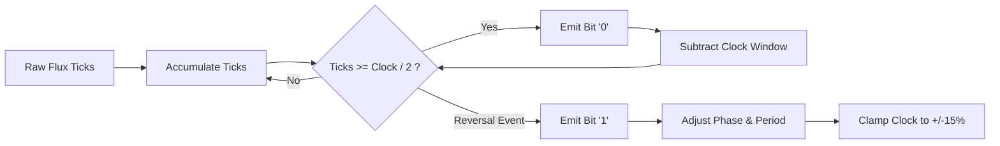

# AlignTesterDiag — Comprehensive Technical Documentation & Architecture Manual 🖴⚡

Welcome to the definitive technical documentation for **AlignTesterDiag**, an ultra-responsive, non-blocking terminal user interface (TUI) diagnostics and calibration platform for floppy disk drives connected via the **Greaseweazle USB flux controller**.

---

## 📑 Table of Contents

1. [System Architecture & Concurrency Model](#1-system-architecture--concurrency-model)
2. [Greaseweazle Hardware Protocol & Interfacing](#2-greaseweazle-hardware-protocol--interfacing)
3. [Electromechanical Timings & Drive Compatibility](#3-electromechanical-timings--drive-compatibility)
4. [Magnetic Flux Processing & DPLL MFM Decoder](#4-magnetic-flux-processing--dpll-mfm-decoder)
5. [Real-Time Alignment Diagnostic Engine](#5-real-time-alignment-diagnostic-engine)
6. [Acoustic Variometer & Alignment Radar](#6-acoustic-variometer--alignment-radar)
7. [High-Precision Spindle Tachometer & Live RPM Jitter Engine](#7-high-precision-spindle-tachometer--live-rpm-jitter-engine)
8. [User Interface, Visual Indicators & Controls](#8-user-interface-visual-indicators--controls)
9. [Standalone Test Binaries & Verification Suite](#9-standalone-test-binaries--verification-suite)
10. [Technical Roadmap & Multi-System Future Support](#10-technical-roadmap--multi-system-future-support)

---

## 1. System Architecture & Concurrency Model

AlignTesterDiag is engineered around a **100% non-blocking, multi-threaded architecture** designed to maintain a consistent ~60 Hz terminal rendering framerate while continuously capturing raw flux transitions over USB and synthesizing pitch-modulated audio feedback.


### 1.1 Concurrency Topology
The application executes across three decoupled OS threads:

1. **Main UI & Render Thread (`src/main.rs`, `src/ui.rs`):**
   - Drives the **Ratatui** and **Crossterm** TUI engine.
   - Drains incoming status updates from the hardware worker via `rx_status.try_recv()`.
   - Polls keyboard input with a 15 ms timeout slice (`crossterm::event::poll(Duration::from_millis(15))`).
   - Translates key presses into strongly-typed `HwCmd` messages sent to `tx_cmd`.
2. **Hardware I/O & Decoding Thread (`src/hw/mod.rs`):**
   - Owns the USB CDC serial connection to the Greaseweazle hardware (`serialport`).
   - Manages drive selection, motor power sequencing, track seeking, and raw flux stream captures.
   - Executes the software Digital Phase-Locked Loop (DPLL) and MFM sector decoding pipeline.
   - Publishes periodic `DriveStatus` snapshots via `tx_status`.
   - Dispatches `AudioEvent` notifications to the audio thread via `tx_audio`.
3. **Real-Time Sound Worker Thread (`src/audio.rs`):**
   - Listens on a dedicated unbounded channel for `AudioEvent` signals.
   - Automatically drains intermediate backlog events to eliminate latency and acoustic lag.
   - Issues non-blocking Win32 `Beep()` or POSIX terminal bell pulses.

### 1.2 Thread Communication Enums

```rust
pub enum HwCmd {
    SelectUnit(u8),
    ToggleDriveUnit,
    SetMotor(bool),
    ToggleMotor,
    MeasureRpm,
    Seek(u8),
    RecalibrateSeek,
    ZeroTrack,
    SetHead(u8),
    SetHeadSelection(HeadSelection),
    ToggleHead,
    Analyze,
    StartAnalysis,
    ReadData,
    ToggleVerbose,
    ToggleBeep,
    SetVerbose(bool),
    SetBeep(bool),
    Stop,
    PanicReset,
    Exit,
}
```

---

## 2. Greaseweazle Hardware Protocol & Interfacing

AlignTesterDiag interfaces directly with the Greaseweazle firmware over USB CDC Virtual COM port at 115,200 baud. It supports automated device discovery and communicates using the native Greaseweazle binary protocol.

### 2.1 Auto-Discovery
During startup, `find_greaseweazle()` scans all available serial ports for USB Vendor/Product IDs:
- **VID:** `0x1209` (Generic Open Source Hardware)
- **PID:** `0x4D22` (Greaseweazle v4) / `0x4D69` (Greaseweazle v4.1)

If USB enumeration fails, the engine falls back to testing standard serial paths (`COM2`, `COM10`, `/dev/ttyACM0`, `/dev/ttyS2`) by asserting DTR/RTS control lines.

### 2.2 Protocol Opcode Reference

All commands follow the Greaseweazle frame format: `[CMD_OPCODE, FRAME_LENGTH, ARGS...]`. The controller responds with a 2-byte header `[CMD_ECHO, STATUS]` followed by optional payload bytes.

| Opcode (Hex) | Command Name | Arguments | Response Payload | Purpose |
|:---|:---|:---|:---|:---|
| `0x00` | `CMD_GET_INFO` | `[0x00, 0x03, 0x00]` | 32 bytes | Query firmware version, hardware model, sample clock frequency |
| `0x0E` | `CMD_SET_BUS_TYPE` | `[0x0E, 0x03, 0x01]` | 0 bytes | Configure interface pinout (`0x01` = IBM PC standard) |
| `0x0C` | `CMD_SELECT` | `[0x0C, 0x03, unit]` | 0 bytes | Assert drive select line (`0` = Drive A, `1` = Drive B) |
| `0x06` | `CMD_MOTOR` | `[0x06, 0x04, unit, state]` | 0 bytes | Control spindle motor (`1` = ON, `0` = OFF) |
| `0x02` | `CMD_SEEK` | `[0x02, 0x03, cyl]` | 0 bytes | Step head carriage to logical cylinder (`0` to `83`) |
| `0x03` | `CMD_HEAD` | `[0x03, 0x03, head]` | 0 bytes | Select physical head (`0` = Lower / Side 0, `1` = Upper / Side 1) |
| `0x07` | `CMD_READ_FLUX` | `[0x07, 0x0A, 0x00, 0x00, 0x00, 0x00, revs, 0x00, 0x00, 0x00]` | Stream | Stream raw magnetic flux transition timings |
| `0x14` | `CMD_GET_PIN` | `[0x14, 0x03, pin_num]` | 1 byte | Read logic level of physical connector pin |

<details>
<summary>🔍 <b>Hardware Pin Monitoring Details (Active-Low Signals)</b></summary>

Floppy interface signals utilize active-low open-collector logic ($0 = \text{Asserted / Low}$, $1 = \text{Negated / High}$). AlignTesterDiag monitors:

- **Pin 28 (`/WRTPRT`):** Write Protect sensor. Sampled via `CMD_GET_PIN (0x14, 28)`. Low indicates the diskette write-protect notch is open.
- **Pin 26 (`/TRK00`):** Optical Track 0 sensor. Read via `DriveStatus`. Indicates carriage is resting at the physical base stop.
- **Pin 8 (`/INDEX`):** Spindle index pulse sensor. Emits one low pulse per revolution.
</details>

---

## 3. Electromechanical Timings & Drive Compatibility

Floppy disk drives incorporate physical stepper motors, lead screws, and rotating mechanical spindles subject to inertia and vibration. AlignTesterDiag enforces strict timing constants to ensure reliable operation across legacy 34-pin PC drives and 26-pin slim notebook drives.

```text
[Motor Start] ──(350 ms)──> [Spindle Stabilized @ 300 RPM]
[Step Pulse]  ──(15-30 ms)─> [Vibration Dampened] ──> [Flux Read]
[Head Switch] ──(1 ms)────> [Preamplifier Settled] ──> [Flux Read]
```

### 3.1 Electromechanical Timing Constants

| Constant | Value | Description & Technical Rationale |
|:---|:---:|:---|
| `STEPPER_WAKEUP_DELAY_MS` | `15 ms` | **Stepper Driver Electronic Wake-up Delay:** On 26-pin FFC drives (e.g. TEAC FD-05HG with adapter), the stepper motor driver IC is powered down when the spindle motor signal is negated. This delay ensures power rail stabilization before issuing step pulses. |
| `HEAD_SETTLE_TIME_MS` | `30 ms` | **Head Settling & Damping Delay:** Mechanical carriage dampening time after a multi-track seek to eliminate head bounce and vibration before reading flux. |
| `HEAD_SWITCH_SETTLE_MS` | `1 ms` | **Electronic Head Switch Settle Time:** Preamplifier stabilization delay when switching between Head 0 and Head 1. |
| `SPIN_UP_DELAY_MS` | `350 ms` | **Motor Spin-Up Delay:** Time required for the DC brushless spindle motor to accelerate from 0 to 300 RPM and lock index synchronization. |
| `RECALIBRATE_WAIT_MS` | `200 ms` | **Track 0 Shock Dissipation Delay:** One full disk revolution (~200 ms) allowed after optical stop recalibration to dissipate mechanical shock before MFM decoding. |
| `DWELL_TIME_TRK0_MS` | `60 ms` | **Dwell Time at Track 0:** Carriage stabilization pause at the physical stop during recalibrate-and-return sequences. |
| `DEFAULT_SERIAL_TIMEOUT_MS` | `1000 ms` | **USB Flux Read Timeout:** Maximum allowable communication window for flux packet reception. |

### 3.2 Motor-Gated Seek Operation
When stepping tracks while the motor is stopped, issuing immediate step pulses will fail on 26-pin drives whose stepper drivers are powered off. `perform_motor_gated_seek()` resolves this:
1. Temporarily asserts motor power (`CMD_MOTOR = 1`).
2. Waits `STEPPER_WAKEUP_DELAY_MS` (15 ms) for driver IC stabilization.
3. Issues `CMD_SEEK` to the target cylinder.
4. Restores motor state to OFF.

If the motor is already running (e.g., in Analyze or Tachometer mode), the seek executes immediately without extra latency.

---

## 4. Magnetic Flux Processing & DPLL MFM Decoder

AlignTesterDiag implements a high-performance software **Digital Phase-Locked Loop (DPLL)** and **Modified Frequency Modulation (MFM)** decoding engine capable of recovering clean bitstreams from noisy analog flux reversals.

### 4.1 Greaseweazle Flux Encoding
Greaseweazle transmits flux transitions as a stream of byte-encoded timer ticks measured against its internal **72 MHz sample clock**:
- Byte `1..=249`: A flux reversal occurred $N$ ticks after the previous event.
- Byte `0xFA`: Extension marker adding $+250$ ticks without a flux reversal.

$$\text{Interval (seconds)} = \frac{\text{Total Ticks}}{72{,}000{,}000}$$

### 4.2 Software DPLL Architecture
The software DPLL (`pll_flux_to_mfm_bits`) dynamically tracks spindle speed fluctuations and instantaneous phase jitter:



$$\text{Clock}_{\text{nom}} = \frac{72{,}000{,}000}{2 \times \text{Bitrate (bps)}} \implies \begin{cases} 72 \text{ ticks} & \text{for 500 kbps (HD)} \\ 144 \text{ ticks} & \text{for 250 kbps (DD)} \end{cases}$$

$$\text{Clock}_{\min} = \text{Clock}_{\text{nom}} \times 0.85, \quad \text{Clock}_{\max} = \text{Clock}_{\text{nom}} \times 1.15$$

Phase adjustment ($\alpha = 0.05$) and period adjustment ($\beta = 0.05$) adapt the clock window on every flux pulse:
$$\text{Clock} \leftarrow \text{Clock} + \Delta\text{Ticks} \times \beta$$

### 4.3 Automated Density Detection
By evaluating average flux transition intervals across the initial revolution, the engine classifies disk density automatically:
- **Average Cell $\le 240$ ticks:** High Density (HD, 500 kbps, 18 sectors/track @ 300 RPM).
- **Average Cell $> 240$ ticks:** Double Density (DD, 250 kbps, 9 sectors/track @ 300 RPM).

### 4.4 MFM Address Marks & CRC-16 CCITT
MFM encoding uses clock bits to separate data bits. Special synchronization words violate standard MFM clock rules to create unique framing markers.

```text
MFM Sync Word: 0x4489 (Decodes to 0xA1 with missing clock transition between bits 4 and 5)
```

| Marker | Sync Sequence | Mark Byte | Description |
|:---|:---|:---:|:---|
| `IAM` | `0xC2C2C2` | `0xFC` | **Index Address Mark:** Marks the start of track flux. |
| `IDAM` | `0xA1A1A1` (`0x448944894489`) | `0xFE` | **ID Address Mark:** Precedes cylinder, head, sector, size code header. |
| `DAM` | `0xA1A1A1` (`0x448944894489`) | `0xFB` | **Data Address Mark:** Precedes 512-byte sector data payload. |
| `DDAM` | `0xA1A1A1` (`0x448944894489`) | `0xF8` | **Deleted Data Address Mark:** Marks sector as deleted/bad. |

#### CRC-16 CCITT Calculation
Both sector headers and data payloads are validated using the standard CCITT polynomial:

$$P(x) = x^{16} + x^{12} + x^5 + 1 \quad (\text{Polynomial: } \mathtt{0x1021}, \text{ Initial Seed: } \mathtt{0xFFFF})$$

The calculation includes the three `0xA1` sync bytes:
```rust
fn crc16_ccitt(data: &[u8]) -> u16 {
    let mut crc: u16 = 0xFFFF;
    for &b in data {
        crc ^= (b as u16) << 8;
        for _ in 0..8 {
            if (crc & 0x8000) != 0 {
                crc = (crc << 1) ^ 0x1021;
            } else {
                crc <<= 1;
            }
        }
    }
    crc
}
```

---

## 5. Real-Time Alignment Diagnostic Engine

The diagnostic engine continuously measures head positioning accuracy relative to the magnetic track centerline, identifying track slippage, misaligned head carriages, and azimuth errors.

### 5.1 Alignment Metric Calculation
Alignment quality is calculated from the ratio of successfully decoded sectors matching the target cylinder vs. expected sectors:

$$\text{Mechanical Alignment } (\%) = \left( \frac{\sum \text{Valid Sectors on Target Track}}{\text{Total Expected Sectors}} \right) \times 100$$

- **$\ge 95\%$ (Green):** Nominal factory alignment.
- **$70\% - 94\%$ (Yellow):** Degraded alignment / marginal tracking.
- **$< 70\%$ (Red):** Severe mechanical misalignment or corrupt track.

### 5.2 Single-Head vs. Dual-Head ("Both" Mode) Operation
Users can toggle head acquisition mode using the <kbd>H</kbd> key:

1. **Head 0 / Head 1 Modes:** Continuously samples the selected physical head, displaying a sliding history stream of the latest 12–13 revolution passes.
2. **"Both" Mode (Dual-Head Consolidated):** Alternates head selection on every revolution pass (`Head 0` $\leftrightarrow$ `Head 1`), presenting a dedicated **2-line persistent display**:
   - **Line 1:** Head 0 status ribbon and metrics.
   - **Line 2:** Head 1 status ribbon and metrics.
   - An active cursor pointer (`► `) indicates which head is currently being sampled.

### 5.3 Cross-Track Divergence Detection
When operating in "Both" mode, if Head 0 reads Track $N$ while Head 1 reads Track $N \pm 1$ (due to physical carriage skew or split head alignment), the engine immediately triggers:
- Diagnostic Flag: `MISMATCH: Track X on Head 0, Track Y on Head 1`
- Alignment penalty: Alignment score is reduced to $50\%$ or lower.
- Orange/Red ribbon highlighting on misaligned segments.
- Immediate **220 Hz dissonant warning buzz** from the audio variometer.

---

## 6. Acoustic Variometer & Alignment Radar

To allow technicians to align floppy drive head carriages without constantly looking at the screen, AlignTesterDiag includes a real-time **Acoustic Variometer** inspired by soaring flight instrumentation.

### 6.1 Dynamic Frequency Modulation
In nominal alignment mode, audio frequency modulates continuously based on the instantaneous sector quality score $Q\% = \min(Q_{\text{H0}}, Q_{\text{H1}})$:

$$\text{Pitch (Hz)} = 440 + \left( \frac{\text{clamp}(Q\%, 30, 100) - 30}{70} \right) \times (1760 - 440)$$

```text
  30% Quality ──>  440 Hz (A4)
  65% Quality ──> 1100 Hz (C#6)
 100% Quality ──> 1760 Hz (A6)
```

### 6.2 Sonic Signature Mapping

| Audio Event | Frequency | Duration | Acoustic Profile & Trigger Condition |
|:---|:---:|:---:|:---|
| **Perfect Alignment** | `440 Hz – 1760 Hz` | `40 ms` | Smooth harmonic tone. Dynamic pitch tracking signal quality $Q\%$. |
| **Track Mismatch** | `220 Hz` | `120 ms` | Low dissonant alarm. Triggered on cross-track divergence ($T_{\text{H0}} \ne T_{\text{H1}}$) or carriage off-target. |
| **CRC / Missing Sector** | `150 Hz` | `20 ms` | Attenuated transient click. Indicates missing sector ID or CRC data corruption. |

### 6.3 Low-Latency Audio Queue
The audio thread processes signals from `crossbeam_channel::Receiver<AudioEvent>`. Under high revolution speeds, intermediate queued beeps are drained:
```rust
while let Ok(mut event) = rx.recv() {
    while let Ok(newer) = rx.try_recv() {
        event = newer; // Drain backlog to eliminate acoustic lag
    }
    play_audio_event(event);
}
```

---

## 7. High-Precision Spindle Tachometer & Live RPM Jitter Engine

Accessed via the <kbd>L</kbd> key, the Spindle Tachometer measures disk rotational speed directly from hardware index pulses at **72 MHz sub-microsecond resolution**.

### 7.1 Mathematical Model & Jitter Calculation
The controller captures timer ticks between successive index pulses:

$$\text{Revolution Period } (ms) = \frac{\Delta\text{Ticks}}{72{,}000}$$

$$\text{Instant RPM} = \frac{60{,}000}{\text{Revolution Period } (ms)}$$

To filter high-frequency motor flutter without concealing mechanical drift, AlignTesterDiag computes:
- **Rolling Average ($\text{Avg RPM}$):** 10-revolution sliding window average.
- **Peak-to-Peak Speed Jitter ($\Delta\text{RPM}$):** $(\text{Max RPM} - \text{Min RPM}) / 2$.
- **Percentage Jitter ($\pm\Delta\%$):** $\left( \frac{\text{Max RPM} - \text{Min RPM}}{2 \times \text{Avg RPM}} \right) \times 100$.

### 7.2 21-Character Visual Centering Gauge
The UI renders an intuitive centering gauge depicting deviation from the nominal 300.0 RPM target:

```text
[----|----▼----|----]  <-- Nominal Target (300.0 RPM +/- 0.5% - Light Green)
[----|---▼|----|----]  <-- Moderate Drift (297.0 RPM +/- 1.0% - Yellow)
[▼---|----|----|----]  <-- Severe Under-speed (< 295.5 RPM - Red)
[----|----|----|---▼]  <-- Severe Over-speed (> 304.5 RPM - Red)
```

### 7.3 Motor Health Classification Matrix

| Jitter Range ($\pm\Delta\%$) | Rating | Health Assessment |
|:---|:---:|:---|
| $\le \pm 0.20\%$ | `★★★★★` | **EXCELLENT STABILITY:** Direct-drive quartz-locked precision. |
| $\le \pm 0.50\%$ | `★★★★☆` | **GOOD STABILITY:** Nominal belt-drive performance. |
| $\le \pm 1.00\%$ | `★★★☆☆` | **ACCEPTABLE STABILITY:** Usable; minor spindle belt wear or dry bearings. |
| $> \pm 1.00\%$ | `★☆☆☆☆` | **UNSTABLE MOTOR SPEED:** Defective drive belt, failing motor controller, or excessive friction. |

---

## 8. User Interface, Visual Indicators & Controls

The interface is divided into three primary functional zones: Top Header, Left Control Menu, and Right Diagnostic Panel.

```text
┌─────────────────────────────────────────────────────────────────────────────────────────────────────────────────────────┐
│ A: 500k HD    T40  H0     Flags: [-wRz-]   WP: WRITE-ENABLED     18x512  27  84         ► [READING / ANALYZING /]        │
│  1  2  3  4  5  6  7  8  9 10 11 12 13 14 15 16 17 18                                                                   │
│ 0....+....1....+....2....+....3....+....4....+....5....+....6....+....7....+....8...                                   │
├───────────────────────────────┬─────────────────────────────────────────────────────────────────────────────────────────┤
│ Insert formatted              │ === REAL-TIME ALIGNMENT ANALYSIS & DIAGNOSTICS ===                                      │
│ diskette                      │                                                                                         │
│                               │ ► Mechanical Alignment    : 100.0%  [ ████████████████████ ]                            │
│ UNIT : Drive 0 (A:)           │ ► Requested Track Sectors : 18 sectors                                                  │
│ STAT : READ/ANALYZ /          │ ► Off-Track Sectors       : 0 (NONE (Perfect))                                          │
│ TRK0 : OFF                    │ ► CRC Integrity Check     : 100% OK (0 errors)                                          │
│ INDEX: ON                     │                                                                                         │
│ MOT  : ON                     │ --- Read Sectors Stream (Standard Mode) ---                                             │
│ WPROT: OFF                    │   T:40 H:0 Rate:500k MFM [ ■ ■ ■ ■ ■ ■ ■ ■ ■ ■ ■ ■ ■ ■ ■ ■ ■ ■ ] (18/18 OK)             │
│ RPM  : 300.1 RPM              │ ► T:40 H:0 Rate:500k MFM [ ■ ■ ■ ■ ■ ■ ■ ■ ■ ■ ■ ■ ■ ■ ■ ■ ■ ■ ] (18/18 OK)             │
│ BEEP : ON (Radar)             │                                                                                         │
│ VERB : OFF                    │ Log: Reading track 40 head 0...                                                         │
└───────────────────────────────┴─────────────────────────────────────────────────────────────────────────────────────────┘
```

### 8.1 Visual Components
1. **Top Header Banner:**
   - **Drive & Track:** Active unit (`A:` / `B:`), Density (`500k HD` / `250k DD`), Cylinder (`T40`), Head (`H0`, `H1`, `HB(H0)`).
   - **Access Flags:** `[-wRz-]` (`w` = Write enabled, `R` = Recalibrate, `z` = Zero track).
   - **Write Protect Badge:** `WP: PROTECTED` (Yellow) vs. `WP: WRITE-ENABLED` (Cyan).
   - **Sector Map:** Numbered badges highlighting sector availability and CRC errors in red.
   - **Track Ruler (0–83):** 84-character ruler highlighting carriage travel with solid white block.
2. **Left Navigation Panel:**
   - Hardware signal states (`TRK0`, `INDEX`, `MOT`, `WPROT`, `RPM`, `BEEP`, `VERB`).
   - Comprehensive keyboard shortcut legend.
3. **Right Diagnostic Stream Panel:**
   - Real-time segmented ribbons:
     - 🟩 `■ ` (Light Green): Valid sector read with correct IDAM and CRC.
     - 🟥 `■ ` (Light Red): Sector read with CRC corruption.
     - 🟨 `■ ` (Yellow): Special mark (`NO-DAM`, `DEL-DAM`).
     - 🟧 `■ ` (Orange): Misaligned sector claiming a different track ID (`MISALIGNED`).
     - ⬜ `░ ` (Dark Gray): Missing sector.

---

## 9. Standalone Test Binaries & Verification Suite

AlignTesterDiag includes dedicated test utilities and a 93-test automated unit suite.

### 9.1 Standalone Binaries (`src/bin/`)
- `gw_read_track.rs`: Captures 1 full revolution of raw flux and calculates average flux cell duration, validating the 240-tick HD/DD threshold.
- `gw_test.rs`: Step-by-step diagnostic verification tool exercising unit selection, motor control, and seek operations.
- `test_mfm_decoder.rs`: Offline validation test bench for the DPLL algorithm and CRC-16 engine.
- `test_sector_gen.rs`: Validates sector interleave orders across 9, 15, and 18 sectors/track formats.

### 9.2 Automated Unit Test Harness
Run the test suite using Cargo:
```bash
cargo test
```

The 93 unit tests validate:
- State transitions on `HwCmd` and `Action` dispatches.
- DPLL boundary clamping, RMS phase jitter, and frequency adaptation.
- Mathematical variometer pitch bounds ($440 \text{ Hz} \le f \le 1760 \text{ Hz}$).
- Spindle tachometer rolling average windowing and jitter calculations.
- Dual-head "Both" mode consolidation and mismatch handling.
- TUI ribbon span coloring and dynamic text generation.

---

## 10. Technical Roadmap & Multi-System Future Support

```text
AlignTesterDiag Roadmap
├── ✅ Phase 1: Core TUI, Greaseweazle Driver, DPLL Engine & Audio Variometer
├── 🔄 Phase 2: Mechanical Diagnostics (Endurance Seek, Random Seek, Head Cleaning)
├── 📅 Phase 3: Interactive Low-Level MFM Formatter (Interleave & Cylinder Skew)
└── 📅 Phase 4: Retro Multi-System Encodings (Atari ST, Amiga Paula, Amstrad CPC)
```

<details>
<summary>🕹️ <b>1. Atari ST Format Support (WD1772 MFM — 250 kbps)</b></summary>

- **Standard Geometry:** 9 sectors/track (720 KB double-sided, 360 KB single-sided).
- **Overformatted / Extended:** Support for 10 and 11 sectors/track (Twister / Fastcopy, 800 KB – 880 KB) and extended tracks (80 to 82).
- **Timing:** Adaptation for short $Gap_3$ formats.
</details>

<details>
<summary>🦁 <b>2. Amiga Format Support (Paula MFM — 250 kbps / 500 kbps)</b></summary>

- **Amiga Sync Word:** `0x44894489` repeated twice.
- **Split Even/Odd MFM Decoding:** Paula writes data by splitting bytes into even and odd bit arrays across the track buffer. The decoder reconstructs bytes via interleaved bitwise OR.
- **AmigaDOS Geometry:** 11 sectors/track (512 bytes/sector, 880 KB DD / 1.76 MB HD).
- **Checksum:** 32-bit odd/even XOR checksum calculation.
</details>

<details>
<summary>📼 <b>3. Amstrad CPC & 3-Inch Compact Floppy Drives</b></summary>

- **CPC Sector Numbering:** Data format sectors `0xC1`–`0xC9`, System format sectors `0x41`–`0x49`.
- **3-Inch Drive Geometry:** 40 tracks single/double-sided reversible.
- **Signal Handling:** Proper interpretation of the physical `READY` line on Panasonic/Matsushita mechanisms (EME-156 / EME-216).
</details>

<details>
<summary>💾 <b>4. Interactive Low-Level Formatter (Key <kbd>F</kbd>)</b></summary>

- Full track MFM pattern synthesis (`IAM 0xC2`, `IDAM 0xA1`, `DAM 0xFB`).
- Configurable fill bytes (`0xE5`, `0xF6`, `0x00`), magnetic gaps ($Gap_1$, $Gap_2$, $Gap_3$, $Gap_4$), interleave ratios (1:1, 1:2, 1:3), and cylinder skew.
- Bulk erase mode without flux transitions for complete disk degaussing.
</details>

---

## 📄 License & Credits

- **Author:** AlignTesterDiag Development Team
- **Heritage:** Inspired by Dave Dunfield's **ImageDisk (`IMD`)** and Keir Fraser's **Greaseweazle**.
- **License:** Dual-licensed under [MIT License](https://opensource.org/licenses/MIT) or [Apache License 2.0](https://www.apache.org/licenses/LICENSE-2.0).
